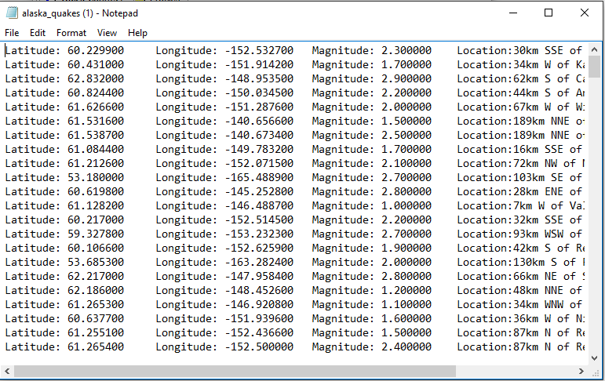
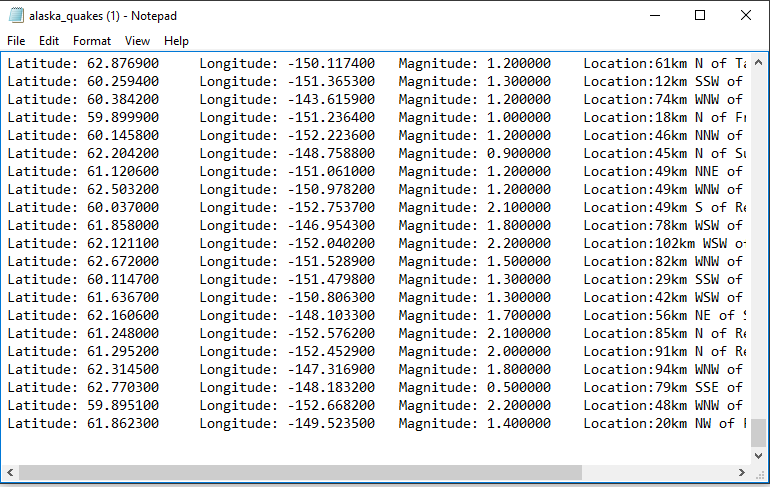
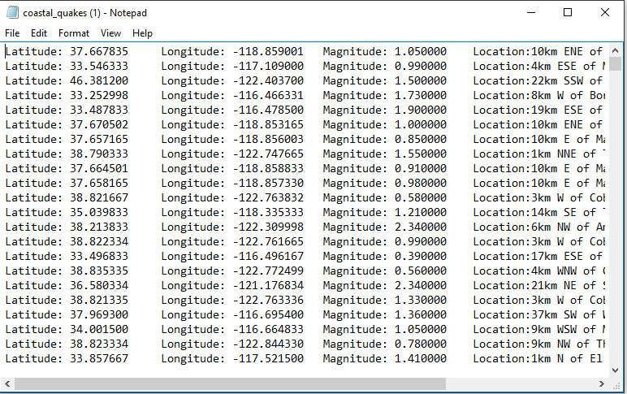
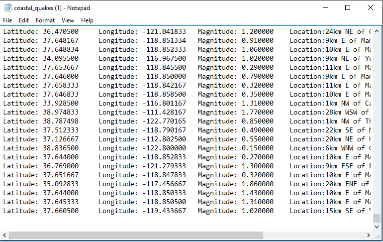

# QuakeWatcher

Utilizes code from https://github.com/atomicpages/Quake-Watcher to retrieve real-time earthquake data from last week in the Alaska region and the Coastal Region.

## Getting Started

These instructions will get you a copy of the project up and running on your local machine for development and testing purposes.

### Prerequisites

```
Command Prompt, Python Interpreter
```

## Running the tests

Once the program is executed, the text files "alaska_quakes" and "coastal_quakes" will be populated.

Sample data of Alaska Earthquakes



Sample data of Coastal Earthquakes


## Authors

* **Steven Duong**
